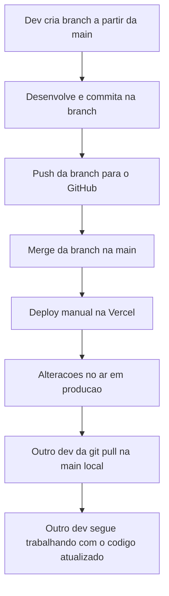

# Fluxo de Trabalho do Projeto (Git + Deploy)

> Este documento deve ser sempre lido pela IA (Claude Code ou similar) antes de
> realizar qualquer alteração neste repositório, independente de qual
> desenvolvedor está no comando. Ele define o processo oficial de
> desenvolvimento, versionamento e deploy do projeto.

## Desenvolvedores

- **Dev A (Gabriel)** — máquina local em `/Users/hanieri/Developer/Portal-do-Corretor`
- **Dev B (outro desenvolvedor)** — máquina local própria, mesmo repositório clonado

Repositório remoto: `https://github.com/gianluccavp-alt/Portal-do-Corretor.git`

Deploy: **Vercel**, feito manualmente (sem deploy automático via CI atrelado ao push).

## Fluxo padrão



## Passo a passo

1. **Criar uma branch para a alteração**
   ```bash
   git checkout main
   git pull origin main
   git checkout -b nome-da-feature
   ```
   Nunca commitar direto na `main`.

2. **Desenvolver e commitar na branch**
   ```bash
   git add <arquivos>
   git commit -m "descrição da alteração"
   ```

3. **Enviar a branch para o GitHub**
   ```bash
   git push -u origin nome-da-feature
   ```

4. **Merge na `main`**
   Depois de validar as alterações, fazer o merge da branch na `main`
   (localmente ou via Pull Request no GitHub) e enviar a `main` atualizada:
   ```bash
   git checkout main
   git merge nome-da-feature
   git push origin main
   ```

5. **Deploy manual na Vercel**
   Quem fez a alteração é responsável por acionar o deploy manualmente na
   Vercel a partir da `main` atualizada. Após o deploy, as mudanças estão em
   produção.

6. **Sincronização do outro desenvolvedor**
   O outro desenvolvedor, ao começar a trabalhar, deve sempre atualizar sua
   cópia local da `main` antes de criar uma nova branch:
   ```bash
   git checkout main
   git pull origin main
   ```
   Isso garante que ele está partindo do código que já está em produção.

## Regras importantes para a IA

- **Sempre criar uma branch nova** antes de editar código, nunca trabalhar
  direto na `main`.
- **Nunca fazer deploy na Vercel automaticamente** — o deploy é sempre manual,
  feito pelo desenvolvedor responsável pela alteração.
- **Sempre rodar `git pull origin main`** antes de criar uma branch nova, para
  evitar divergência e conflitos.
- **Nunca dar push direto na `main`** sem o merge da branch de trabalho.
- Se identificar que a `main` local está desatualizada em relação ao remoto,
  avisar o usuário antes de prosseguir.
- Ao finalizar uma alteração, lembrar o usuário que o deploy na Vercel é
  manual e que o outro desenvolvedor precisa rodar `git pull` para receber as
  mudanças.
